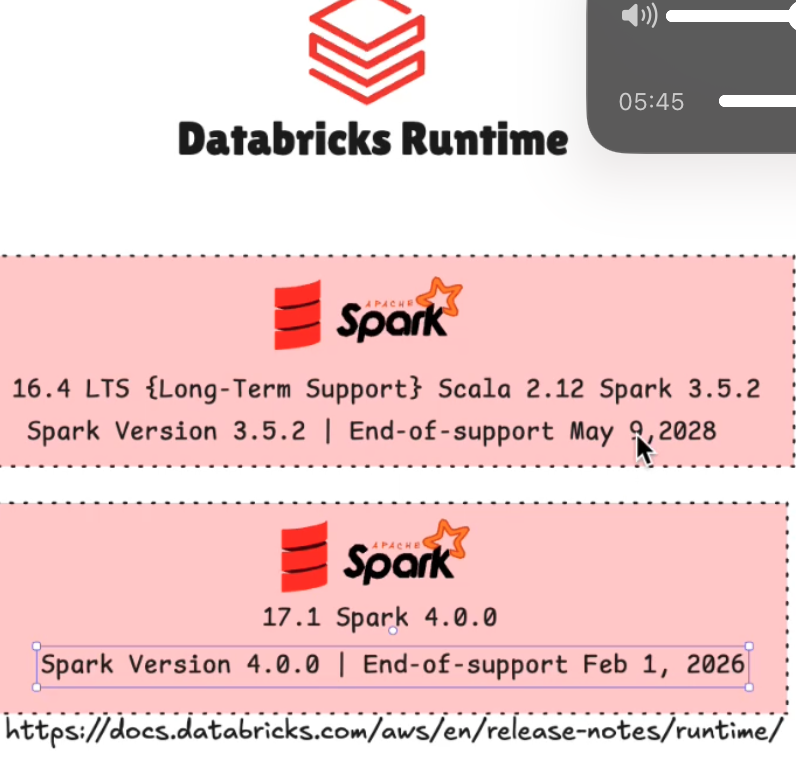
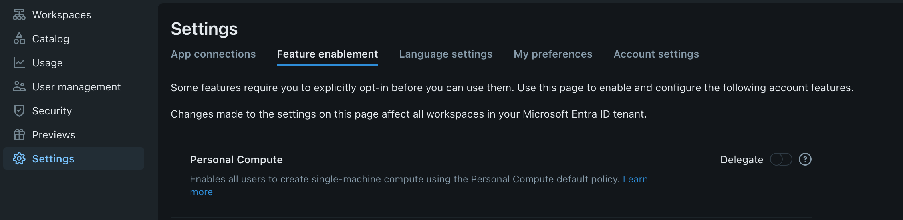
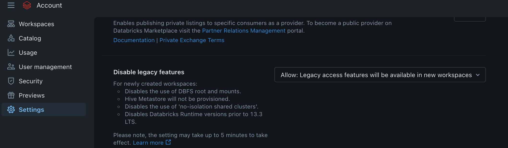

## UC & Compute Policy

* Tipos de clusters

* Databricks Runtime: Versão LTS é uma versão estável a longo prazo com poucas mudanças bruscas, excelente para produção e seu tempo de suporte é bem maior que a versão sem LTS.

Em settings Feature Enablement eu consigo habilitar ou desabilitar que meus usuários tenham personal compute para os meus workspaces.

Também consigo fazer que novos workspaces não possua Hive Metastore e Features antigas...

