# Lake Flow Declarative Pipelines (LDP)

## 📖 Visão Geral

O **Lake Flow Declarative Pipelines (LDP)** (anteriormente conhecido como *Delta Live Tables* ou DLT) é uma estrutura de ETL baseada no Apache Spark projetada para criar pipelines de dados confiáveis e de fácil manutenção.


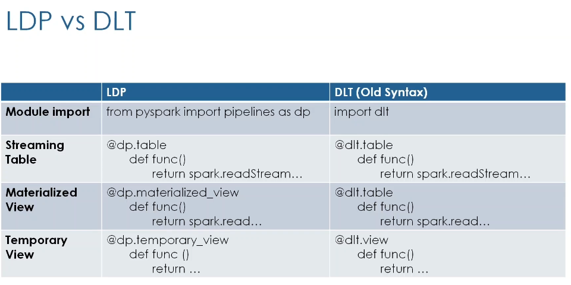

Diferente da abordagem imperativa padrão do Spark, o LDP utiliza um modelo **declarativo**: você define o resultado desejado das transformações (o "o quê") e o framework gerencia a complexidade da execução, orquestração e infraestrutura (o "como").

> **Nota:** A Databricks abriu o código-fonte desta solução, integrando-a ao ecossistema Apache Spark sob o nome **Spark Declarative Pipelines**.


---

## 🚀 Principais Benefícios

* **Abstração de Complexidade:** Elimina a necessidade de gerenciar detalhes de baixo nível do Spark(checkpoints, escritas de stream).
* **Orquestração Automática:** Identifica dependências entre tabelas e visualiza o fluxo de execução (DAG) automaticamente.
* **Gerenciamento Autônomo:** Lida nativamente com *checkpoints*, novas tentativas (retries) e otimização de performance.
* **Operações Avançadas Simplificadas:** Suporte nativo e facilitado para CDC (Change Data Capture), SCD Tipo 2 e verificações de Qualidade de Dados (Expectations).
* **Validação:** Suporte a "Dry Run" para validar a lógica do pipeline sem processar dados.


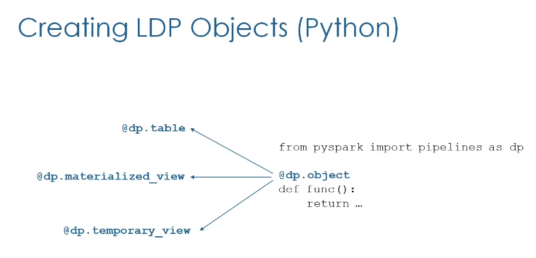
---

## 🧱 Tipos de Objetos no LDP

O LDP permite a definição de três tipos principais de objetos, tanto em Python quanto em SQL:

| Tipo de Objeto | Persistência | Comportamento de Processamento | Caso de Uso Ideal |
| --- | --- | --- | --- |
| **Streaming Table** | Sim (Catálogo) | **Incremental.** Processa apenas novos dados desde a última execução (append-only). | Ingestão quase em tempo real (baixa latência/ms), leitura de Kafka/Autoloader. |
| **Materialized View** | Sim (Catálogo) | **Atualização Completa** (geralmente). Recarrega/substitui dados a cada execução.* | Agregações complexas, Joins, dados que sofrem updates/deletes na origem, source não streaming, boa para BI complexo. Não possui design para low-latency caso de uso a latência de atualizacão está em minutos ou segundos. |
| **Temporary View** | Não (Efêmera) | Processamento temporário durante a execução do pipeline. | Transformações intermediárias e verificações de qualidade que não precisam ser salvas. |

**Nota: Em computação Serverless, algumas Materialized Views podem ser otimizadas para atualizações incrementais.*
---

## ⚡ LDP vs. Apache Spark Tradicional

### Sintaxe Python

* **Spark:** Exige definição explícita de `readStream`, `writeStream` e gestão manual de caminhos de checkpoint.
* **LDP:** Utiliza **decoradores** (`@table` ou `@dlt.table`). A escrita e o checkpoint são abstraídos pelo framework.

### Sintaxe SQL

* **Spark:** Não suporta nativamente a criação de pipelines de streaming apenas com SQL (exige API PySpark).
* **LDP:** Suporte nativo total via SQL:
```sql
CREATE OR REFRESH STREAMING TABLE nome_tabela AS SELECT ...
```
---

## 🛠️ Mudanças da Estrutura Antiga (DLT)

* **Arquivos:** Migração de base exclusiva em Notebooks para suporte a arquivos de script (`.py`, `.sql`).
* **Validação:** Introdução do conceito de execução de teste ("Dry Run") para validação de código. O DLT era baseado em notebooks e tinhamos a opção de validar o código-fonte usando o botão de validação no DLT. Por outro lado agora se baseia em arquivos de script com extensão .py, SQL e o dry-run ajuda a realizar a validação seca para o código-fonte do nosso pipeline sem atualizar nenhum dado.

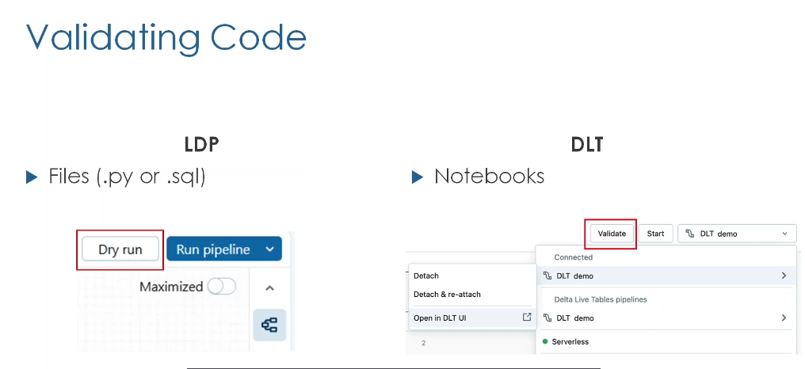

* **Sintaxe:** Evolução dos decoradores e comandos para maior clareza entre objetos de streaming e estáticos.

---

# Projeto Bookstore: Ingestão com LDP (Lake Flow Declarative Pipelines)

## 🎯 Objetivo do Módulo

Refatorar o código PySpark original do projeto "Bookstore" para o estilo declarativo do **LDP**. O foco desta etapa é a **Ingestão de Dados**, criando:

1. **Tabela Bronze (Multiplexer):** Como uma *Streaming Table* (ingestão incremental).
2. **Country Lookup:** Como uma *Temporary View* (auxiliar para joins futuros).

---

## ⚙️ Configuração do Pipeline (UI)

### Criação e Estrutura

* **Caminho:** `Jobs & Pipelines` > `Create ETL Pipeline`.
* **Nome:** `Bookstore Pro Pipeline`.
* **Catálogo/Schema:** `professional`.

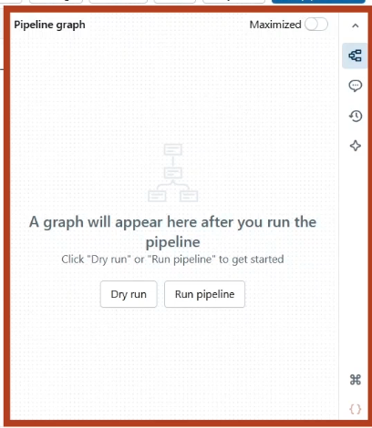
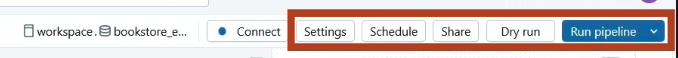

Permite visualizar tabelas e performance:

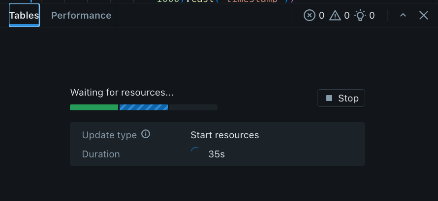

### Organização de Arquivos

O LDP sugere uma estrutura de pastas para organizar o código:

* **`transformations/`**: Pasta padrão para os scripts do pipeline (código-fonte ativo).
* **`explorations/`**: Pasta sugerida para Notebooks auxiliares (ex: análise de dados) que **não** são executados como parte do fluxo do pipeline.


Você pode incluir os arquivos do exploration no pipeline source code:

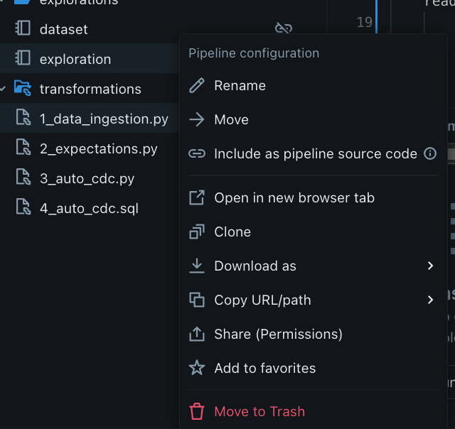

### Configurações de Execução (Settings)

* **Modo do Pipeline:**
* *Triggered (Acionado):* Processa os dados disponíveis e desliga (Batch/Incremental). **Selecionado para esta demo**.
* *Continuous:* Executa continuamente (ex: a cada 2 segundos) para latência mínima.

Settings -> Pipeline Mode
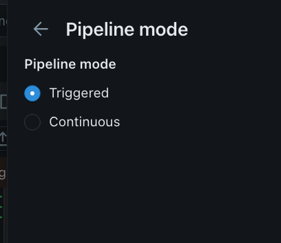

* **Parâmetros:** Adição da chave `dataset_path` para definir o diretório de origem dos dados. (Settings -> Configuration)

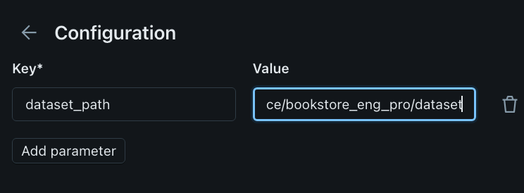

* **Event Logs:** Configuração (em *Advanced Settings*) de uma tabela para armazenar logs de execução do pipeline.


---

## 💻 Implementação (Python/LDP)

### 1. Setup Inicial

Importação do módulo `dlt` (ou `pipelines`) e leitura de parâmetros configurados na UI.

```python
import dlt
from pyspark.sql.functions import *

# Ler configuração definida na UI do Pipeline
dataset_path = spark.conf.get("dataset_path")

```

### 2. Tabela Bronze (Streaming Table)

Utiliza o Auto Loader (`cloudFiles`) para ingestão incremental.

* **Decorador:** `@dlt.table` (gerencia escritas e checkpoints).
* **Propriedades Críticas:**
* `delta.appendOnly = true`: Otimiza para tabelas que só recebem inserções, desabilitando updates e deletes para a tabela bronze.
* `pipelines.reset.allowed = false`: **Proteção de Dados.** Impede que esta tabela seja apagada/zerada se for solicitado um "Full Refresh" do pipeline (essencial para camada Bronze onde a retenção da fonte pode ser curta).

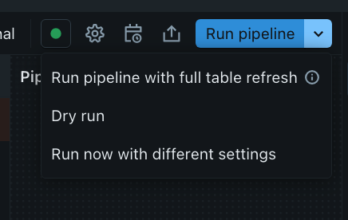

```python
@dp.table(
    name = "bronze", #Parâmetro Name
    partition_cols=["topic", "year_month"],
    table_properties={
        "delta.appendOnly": "true",
        "pipelines.reset.allowed": "false",
    }
)

# Por default, o nome da tabela será o mesmo que o nome da função, mas, se preferir, pode-se adicionar o parêmetro name para especificar o nome da tabela diferente.
# A tabela será criada no catálogo e no schema padrão que você definir na configuração do pipeline, mas você pode usar o namespace de três níveis para manter o objeto em um catálogo ou esquema diferente.
def process_bronze():
    schema = "key BINARY, value BINARY, topic STRING, partition LONG, offset LONG, timestamp LONG"

    bronze_df = (spark.readStream
                    .format("cloudFiles")
                    .option("cloudFiles.format", "json")
                    .schema(schema)
                    .load(f"{dataset_path}/kafka-raw-etl")
                    .withColumn("timestamp", (F.col("timestamp")/1000).cast("timestamp"))  
                    .withColumn("year_month", F.date_format("timestamp", "yyyy-MM"))
                )

    return bronze_df

```

### 3. Visualização Temporária (Temporary View)

Usada para dados auxiliares que não precisam ser persistidos no Data Lake, apenas usados durante a execução.

```python
@dp.temporary_view
def country_lookup():
    countries_df = spark.read.json(f"{dataset_path}/country_lookup")
    return countries_df
```

---

## 🚀 Modos de Execução e Ciclo de Vida

### Validação

* **Dry Run (Execução Seca):** Valida a sintaxe e a lógica do código sem processar dados ou criar tabelas.

### Execução (Run Pipeline)

* **Development Mode (Modo Desenvolvimento):**
* Reutiliza o mesmo cluster (mantém ativo por ~2 horas) para evitar tempo de reinicialização.
* Desativa novas tentativas automáticas (retries) para falhar rápido e permitir debug.


* **Production Mode (Modo Produção):**
* Cria um novo cluster para cada execução (e encerra ao fim).
* Habilita *retries* automáticos para falhas transitórias (ex: erro de inicialização, vazamento de memória).

Se quiser alternar de um modo para outro:

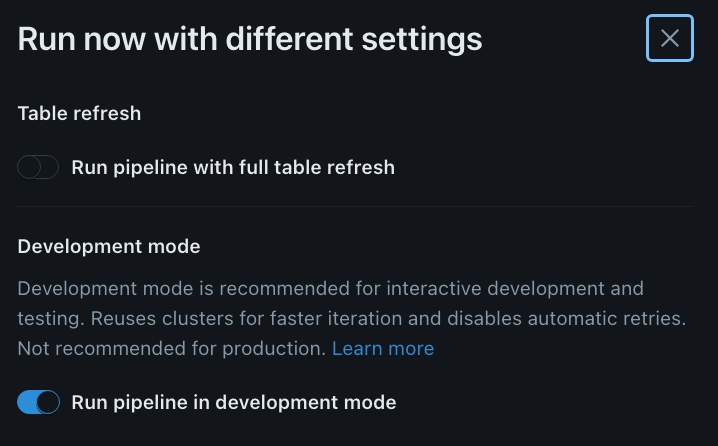
 
---

# Qualidade de Dados no LDP: Expectativas (Expectations)

## 🛡️ O que são Expectativas?

As **Expectativas** são restrições (constraints) de validade aplicadas aos dados à medida que fluem pelo pipeline ETL. Elas funcionam como "Unit Tests" para dados, garantindo integridade e confiabilidade.


* Definem condições booleanas que cada registro deve atender.
* Todas as violações são rastreadas e relatadas nas **métricas** do pipeline.

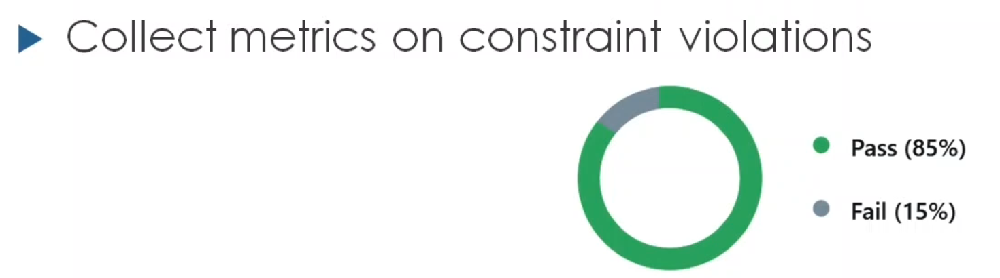

* Podem ser aplicadas em tabelas e views usando SQL ou Python.
* Por default registros que violam alguma constrains são mantidas na tabela.

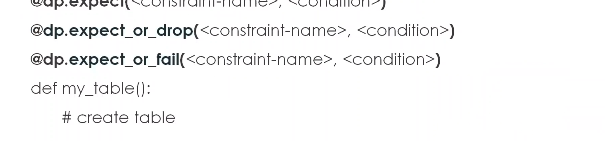

## 🚦 Ações de Violação (Policy)

Você pode definir o que acontece quando um registro falha na validação. Existem três níveis de severidade:

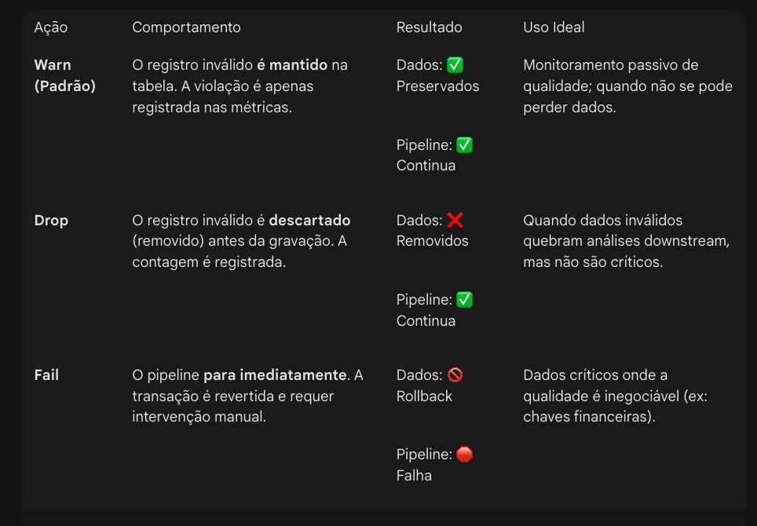

---

## 💻 Sintaxe: Python vs. SQL

### Sintaxe Básica (Uma restrição)

| Ação | Função Python (`@dlt`) | Sintaxe SQL (`CONSTRAINT`) |
| --- | --- | --- |
| **Warn** | `@dlt.expect("descrição", "condição")` | `CONSTRAINT nome EXPECT (condição)` |
| **Drop** | `@dlt.expect_or_drop("descrição", "condição")` | `CONSTRAINT nome EXPECT (condição) ON VIOLATION DROP ROW` |
| **Fail** | `@dlt.expect_or_fail("descrição", "condição")` | `CONSTRAINT nome EXPECT (condição) ON VIOLATION FAIL UPDATE` |

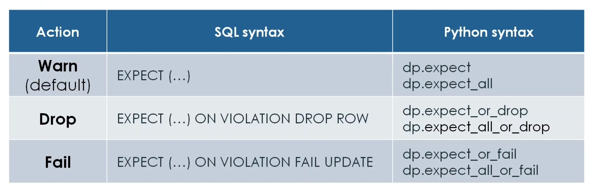

### 1. `expect_or_drop` (Individual)

Define **uma única** regra de validação.

* **Como funciona:** Você passa o nome da regra e a condição booleana.
* **Quando usar:** Quando você quer aplicar apenas uma restrição específica ou prefere escrever cada regra em uma linha separada no seu código.
* **Exemplo:**
```python
@dp.expect_or_drop("id_valido", "id IS NOT NULL")

```

### 2. `expect_all_or_drop` (Coletivo)

Define **múltiplas** regras de validação simultaneamente usando um dicionário Python.

* **Como funciona:** Você passa um dicionário onde as chaves são os nomes das regras e os valores são as condições.
* **Comportamento:** Se o registro violar **qualquer uma** das regras listadas no dicionário, ele será descartado. Funciona como um operador `AND` lógico para a validade (todas devem ser verdadeiras para o registro passar).
* **Quando usar:** Para deixar o código mais limpo quando se tem muitas validações para a mesma tabela.
* **Exemplo:**
```python
@dp.expect_all_or_drop({
    "id_valido": "id IS NOT NULL",
    "valor_positivo": "valor > 0",
    "data_recente": "data >= '2023-01-01'"
})

```


### Resumo

| Função | Quantidade de Regras | Entrada (Input) |
| --- | --- | --- |
| **expect_or_drop** | 1 Regra | Dois argumentos: `(nome, condição)` |
| **expect_all_or_drop** | Várias Regras | Um argumento: Dicionário `{'nome': 'condição', ...}` |

Em ambos os casos, a **ação** é a mesma: se a condição não for atendida, a linha (row) é removida do dataset final e a violação é registrada nas métricas.

### Expectativas Múltiplas (Apenas Python)

No Python, é possível passar um **dicionário** de regras para aplicar várias validações de uma só vez, reduzindo a verbosidade do código.

* `@dlt.expect_all({"regra1": "condicao1", "regra2": "condicao2"})`
* `@dlt.expect_all_or_drop({...})`
* `@dlt.expect_all_or_fail({...})`

---

## 📝 Exemplo Prático


Aqui está o resumo estruturado para o módulo de **Qualidade de Dados na Camada Prata**, seguindo o padrão README.

---

# Projeto Bookstore: Qualidade de Dados (Camada Prata)

## 🎯 Objetivo do Módulo

Implementar a **Camada Prata** do pipeline, focando no refinamento dos dados brutos (Bronze) através da aplicação de **Expectativas (Data Quality Expectations)**.
O objetivo é processar pedidos e livros, garantindo que apenas dados válidos sejam utilizados ou analisados, aplicando diferentes estratégias de tratamento de erro (Alertar, Falhar, Descartar ou Quarentenar).

---

## 🛠️ Configuração e Fluxo de Trabalho

1. **Acesso:** `Jobs & Pipelines` > Selecionar `Bookstore Pro Pipeline`.
2. **Edição:** Clicar em `Edit Pipeline` para adicionar novos scripts.
3. **Fonte de Dados:** Leitura da tabela `bronze_multiplex` (definida anteriormente).
* *Nota:* Graças à propriedade `pipelines.reset.allowed = false` definida na aula anterior, um "Full Refresh" na camada Prata **não** apaga/reprocessa a ingestão da Bronze.

---

## 🚦 Estratégias de Qualidade de Dados (Implementação)

### 1. Apenas Alertar (Monitoramento)

Permite a passagem de dados inválidos, mas registra o erro nas métricas.

* **Função:** `@dlt.expect`
* **Cenário:** Validar se a quantidade do pedido é maior que zero.

```python
@dp.table
@dp.expect("valid_quantity", "quantity > 0")
def orders_silver():
    orders_df = process_orders()
    return orders_df
```

* **Resultado:** Todos os registros são gravados. Violações aparecem como "Warnings" na aba *Table Metrics*.

### 2. Interromper o Pipeline (Fail)

Garante integridade estrita. Se um único registro falhar, o pipeline para.

* **Função:** `@dlt.expect_or_fail`
* **Resultado:** O pipeline falha e reverte a transação. Exige correção na fonte ou ajuste na regra.

### 3. Descartar Registros Inválidos (Drop)

O pipeline continua, mas "filtra" silenciosamente os dados ruins antes da gravação.

* **Função:** `@dlt.expect_or_drop`
* **Resultado:** A tabela final contém apenas registros válidos (ex: 976 de 1000). As métricas mostram quantos foram descartados.

```python
@dp.table
@dp.expect_or_drop("valid_quantity", "quantity <= 0")
def orders_quarantine():
    orders_df = process_orders()
    return orders_df
```

---

### 5. Sinalização (Flagging / Is Quarantined)

Em vez de separar tabelas, adiciona-se uma coluna booleana indicando a validade do registro. Útil para particionamento.

* **Lógica:** Usar `expect_all` para métricas, mas criar uma coluna na transformação.

```python
# Exemplo conceitual
rules = {"valid_price": "price > 0", "valid_date": "updated_at IS NOT NULL"}

@dlt.view(temporary=True)
@dlt.expect_all(rules)
def books_silver():
    return (
        read_bronze_books()
        .withColumn("is_quarantined", expr("NOT(price > 0 AND updated_at IS NOT NULL)"))
    )

```

---

## 📊 Monitoramento e Observabilidade

### Via Interface (UI)

* **Graph:** Clicar na tabela > Aba **Table Metrics**.
* Mostra contagem de registros escritos vs. registros descartados/falhos por regra.

### Via Programática (Event Log)

Os resultados de qualidade são gravados na tabela de logs configurada no pipeline (`event_log`). É possível consultar via SQL para relatórios automatizados.

**Exemplo de Query no Event Log:**
Ocorre em eventos onde `event_type = 'flow_progress'`.

```sql
SELECT
  details:flow_progress:data_quality:expectations
FROM event_log_table
WHERE event_type = 'flow_progress'
```

Isso retorna um JSON contendo o nome da expectativa, dataset associado e contagem de pass/fail.

Aqui está o resumo estruturado sobre **APIs de CDC Automático** no Lake Flow, formatado como um README técnico.

---

# Lake Flow: APIs de CDC Automático (Auto CDC)

## 📖 Visão Geral

As **APIs de CDC Automático** são a nova abordagem simplificada dos Pipelines Declarativos (LDP) para processar fluxos de dados de *Change Data Capture* (CDC).
Elas substituem a complexidade manual de escrever instruções `MERGE INTO`, abstraindo a lógica difícil de sequenciamento e versionamento.

### Principais Vantagens vs. Abordagem Tradicional (`MERGE`)

* **Gestão de Sequência:** Trata automaticamente registros que chegam fora de ordem (*out-of-sequence records*). O `MERGE` tradicional exigia lógica complexa para evitar sobrescrever dados novos com dados antigos.
* **Simplicidade:** Elimina centenas de linhas de código manual.
* **Suporte a SCD:** Suporte nativo para **SCD Tipo 1** (Atualização/Sobrescrita) e **SCD Tipo 2** (Histórico de alterações).

---

## ⚙️ Como Funciona (Arquitetura Interna)

Quando você declara uma tabela usando Auto CDC, o LDP cria dois objetos sob o capô para gerenciar a consistência:

1. **Tabela Interna (Storage):** Mantém o controle de todos os eventos de mudança.
* Utiliza "marcadores de lápide" (*tombstone markers*) para sinalizar linhas excluídas (garantindo que exclusões não sejam efetivadas até que sequências atrasadas sejam processadas).
* Armazena metadados para reordenar dados fora de sequência.

2. **View de Destino:** Uma visualização com o nome da tabela alvo que apresenta apenas o **estado limpo e mais recente** dos dados para o usuário final.

---

## 💻 Sintaxe e Parâmetros

### Sintaxe SQL

O comando base é `CREATE STREAM ... AS AUTO CDC`.
*Nota: A tabela de streaming de destino já deve ter sido criada antes da execução deste comando.*

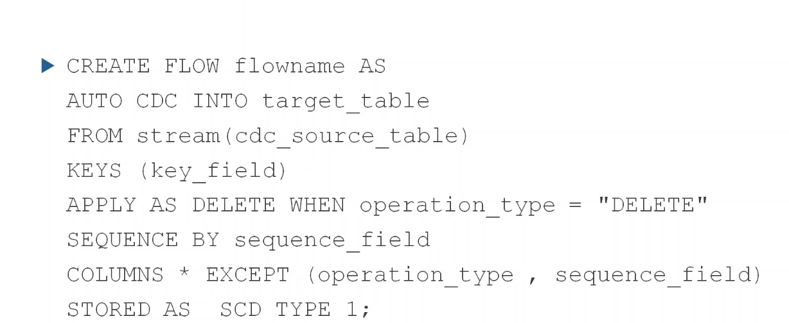

### Parâmetros Principais


### Sintaxe Python

Utiliza a função `create_auto_cdc_stream`. Os parâmetros lógicos são os mesmos do SQL (keys, sequence, etc.).


---

## ⚠️ Nota sobre Legado (Exames de Certificação)

* **APPLY CHANGES INTO:** É a sintaxe antiga (do Delta Live Tables original) para fazer CDC.
* **Status Atual:** Ainda é suportada para retrocompatibilidade e **pode cair no exame atual**, mas a Databricks recomenda fortemente o uso das novas **APIs de Auto CDC**.


---
Aqui está o resumo estruturado para o módulo final do pipeline "Bookstore", cobrindo **Auto CDC**, **Camada Dourada (Gold)** e **Mistura de Python/SQL**, seguindo o padrão README.

---

# Projeto Bookstore: Camadas Silver (CDC) e Gold

## 🎯 Objetivo do Módulo

Finalizar o pipeline implementando lógicas avançadas de processamento:

1. **Auto CDC Tipo 1 (Python):** Para atualizar dados de Clientes (*Upsert*) -> É o default SCD 1.
2. **Auto CDC Tipo 2 (SQL):** Para versionar o histórico de Livros (*SCD Type 2*).
3. **Camada Dourada:** Criação de *Materialized Views* para agregações de negócios (Estatísticas por País e Autor).
4. **Hibridismo:** Uso simultâneo de Python e SQL no mesmo pipeline.

---

## 🔄 Implementação do Auto CDC

### 1. Auto CDC Tipo 1: Clientes (Python)

Atualiza a tabela de clientes onde novos dados sobrescrevem os antigos (*Upsert*).

* **Fonte:** View temporária unindo dados de CDC da Bronze + Lookup de Países.
* **Destino:** Tabela `customers_silver`.
* **Lógica:**
* `keys=["customer_id"]`: Chave primária.
* `sequence_by="order_timestamp"`: Define qual registro é o mais recente em caso de conflito.
* `apply_as_delete_when`: (Opcional) Define lógica para deleções.
* **Resultado:** 396 registros processados (inserts/updates).


### 2. Auto CDC Tipo 2: Livros (SQL)

Mantém histórico de alterações de preço ou detalhes do livro, criando novas linhas para cada versão (*SCD Type 2*).

* **Sintaxe SQL:**
```sql
CREATE STREAMING TABLE books_silver;

APPLY CHANGES INTO books_silver
FROM STREAM(books_bronze_view)
KEYS (book_id)
SEQUENCE BY updated_at
COLUMNS * EXCEPT (updated_at)
STORED AS SCD TYPE 2; -- Habilita o histórico

```


* **Resultado:**
* Adiciona colunas automáticas `__start_at` e `__end_at`.
* O registro atual possui `__end_at` como `NULL`.
* Tabelas SCD Type 2 **não podem ser lidas como stream** diretamente por views materializadas downstream (requer leitura estática ou filtros).


---

## 🏆 Camada Dourada (Materialized Views)

As Views Materializadas são usadas aqui porque requerem agregações complexas e joins em dados que podem sofrer updates (não-append-only).

### 1. Estatísticas Diárias por País (Python)

* **Tipo:** `Materialized View`.
* **Fonte:** Join entre `orders` e `customers`.
* **Importante:** Usa `spark.table("...")` (leitura estática) em vez de `readStream`, pois a tabela de clientes sofre updates (CDC) e não suporta leitura de streaming padrão.

### 2. Vendas por Autor com Janelas (SQL)

* **Objetivo:** Agregação complexa com janelas de tempo.
* **Técnica:** Window Function com deslocamento (*offset*).
* `WINDOW(order_timestamp, '5 minutes', '5 minutes', '2 minutes')`
* Cria janelas de 5 min, sem sobreposição, deslocadas em 2 min.

---

## 🛡️ Qualidade de Dados em SQL

Demonstração de como aplicar *Constraints* diretamente no SQL durante a criação de tabelas da camada Silver/Gold.

```sql
CONSTRAINT valid_id EXPECT (id IS NOT NULL) ON VIOLATION DROP ROW,
CONSTRAINT valid_amount EXPECT (amount > 0) ON VIOLATION FAIL UPDATE

```

---

## ⚡ Otimização e Computação Serverless

* **Atualização Incremental em Materialized Views:**
* Ao usar **Serverless Compute**, o Databricks tenta atualizar Views Materializadas de forma incremental (processando apenas o delta) mesmo para agregações.
* Identificado na UI pelo rótulo **"Incremental"**.
* Se a lógica for muito complexa ou usar Compute Clássico, o sistema reverte automaticamente para **Full Refresh** (recálculo total).

---

Aqui está o resumo estruturado sobre o **Agendamento e Orquestração Avançada de Jobs no Databricks**, formatado como um README técnico.

---

# Databricks Workflows: Orquestração de Pipeline ETL Avançada

## 🎯 Objetivo

Criar um fluxo de trabalho (Job) robusto chamado **Bookstore Pro v2** que automatiza o ciclo de vida do pipeline ETL, incluindo ingestão condicional, execução do pipeline (DLT) e análise dinâmica de tabelas pós-execução.

---

## 🏗️ Estrutura do Job e Tarefas

### 1. Ingestão de Dados (`land_new_data`)

* **Tipo:** Notebook Task.
* **Função:** Simula a chegada de novos arquivos na pasta de origem.
* **Recurso Chave:** Utiliza `dbutils.jobs.taskValues.set()` para passar a contagem de arquivos novos para a próxima tarefa.
* *Exemplo:* `key="number_new_files", value=count`.


### 2. Condicional (`has_new_file`)

* **Tipo:** If/Else Condition Task.
* **Lógica:** Verifica se há dados novos para processar.
* **Condição:** `tasks.land_new_data.values.number_new_files > 0`.
* **Ramificações:**
* **True:** Segue para executar o Pipeline ETL.
* **False:** Segue para tarefa de Log (não há dados).

### 3. Execução do Pipeline (`run_pipeline`) - *Ramo True*

* **Tipo:** Delta Live Tables Pipeline Task.
* **Ação:** Aciona a atualização (Triggered Update) do pipeline `Bookstore Pro Pipeline`.

### 4. Logging (`log_no_data`) - *Ramo False*

* **Tipo:** Notebook Task.
* **Função:** Registra que o job rodou mas não havia dados.
* **Parâmetros Dinâmicos:** Usa variáveis de contexto do job para enriquecer o log.
* `{{job.id}}`: ID do Job.
* `{{job.start_time}}`: Data/hora de início (ISO Format, UTC).


* **Notificação:** Configurada para enviar e-mail em caso de sucesso (aviso proativo).

### 5. Listagem de Tabelas (`list_tables`)

* **Tipo:** Notebook Task (executa após o Pipeline).
* **Função:** Consulta o `system.information_schema` para listar dinamicamente todas as tabelas e views criadas pelo pipeline.
* **Saída:** Retorna um Array de objetos (JSON) contendo nome e tipo das tabelas via `taskValues`.

### 6. Análise Dinâmica (`tables_iterator`)

* **Tipo:** For Each Loop Task.
* **Input:** Array retornado pela tarefa `list_tables`.
* **Concorrência:** Configurável (permite analisar várias tabelas em paralelo).
* **Tarefa Aninhada (`analyze_table`):**
* Notebook que roda estatísticas simples (count, sample) para cada tabela.
* **Parâmetros:** Recebe valores dinâmicos do iterador: `{{input.table_name}}`, `{{input.table_type}}`.

---

## ⚙️ Configurações Avançadas e Dicas

### Parâmetros de Trabalho (Job Parameters)

* Definidos no nível do Job (menu direito), são propagados automaticamente para todas as tarefas.
* Útil para constantes globais como `catalog` e `schema`.

### Reparo de Execução (Repair Run)

* Funcionalidade crítica para falhas.
* Se um job falha (ex: parâmetro esquecido), permite:
1. Corrigir o erro ou injetar o parâmetro faltante na hora.
2. Reiniciar o job **apenas a partir das tarefas que falharam ou foram puladas**, sem reexecutar o que já teve sucesso.

### Variáveis Dinâmicas

O Databricks oferece uma sintaxe de "chaves duplas" `{{...}}` para injetar contexto em tempo de execução:

* **Valores de Tarefas:** `{{tasks.<task_name>.values.<key>}}`
* **Tempo:** `{{job.start_time}}` (UTC)
* **Loop:** `{{input.<field_name>}}`

---