# Unity Catalog

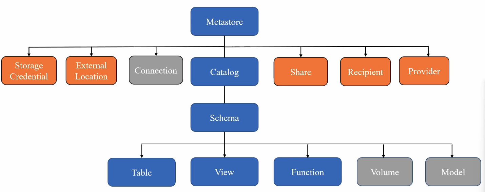

### Curso: Udemy - Azure Databricks end to end project with Unity Catalog CI/CD

  <blockquote>
Atua como uma interface unificada para os workspaces em relação a User Management, Metastore, Acess Controls.  
E também pode ver quem tem acesso a quê. Tem Acess Control, Lineage, Discovery, Monitoring, Auditing, Sharing.  
Facilita o gerenciamento e governança principalmente quando tenho vários workspaces e tenho que centralizar o permissionamento.
  </blockquote>

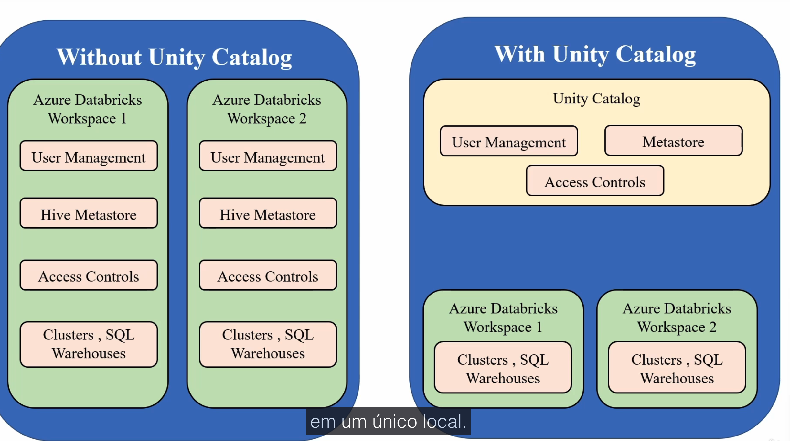

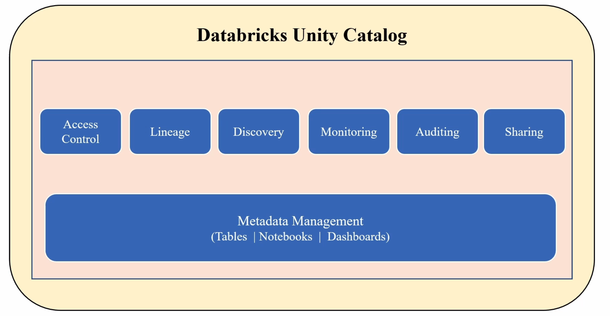

## Databricks Access Connector

O Databricks Access Connector, um serviço que funciona como identidade gerenciada para permitir que o Unity Catalog / Metastore tenha acesso centralizado ao Azure Data Lake Gen2.

Como o Unity Catalog não é um recurso do Azure e não pode receber permissões diretamente via IAM, é necessário criar uma identidade gerenciada — o Databricks Access Connector.
Depois, essa identidade recebe o papel Storage Blob Data Contributor na conta de armazenamento.

Assim, o Unity Catalog poderá usar essa identidade para acessar o Data Lake e criar o Metastore, que é onde serão armazenadas tabelas gerenciadas e configurações de governança.

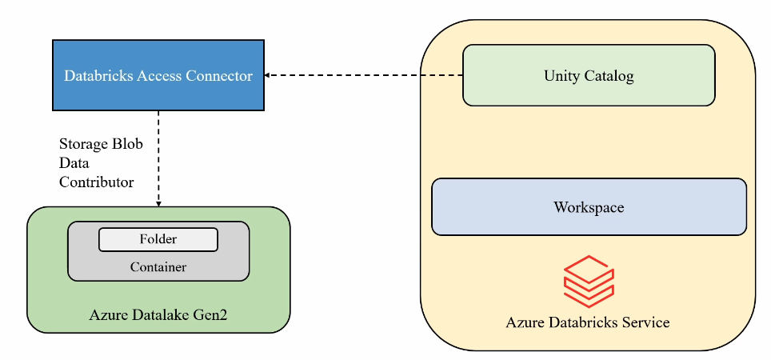

Passos do vídeo:

1. Criar o Databricks Access Connector.

* Obs: Quando é criado um workspace no databricks já e criado um access connector denominado: unity-catalog-access-connector, então se não desejar, não precisa criar um novo.

- Copie o Resource ID depois que foi criado

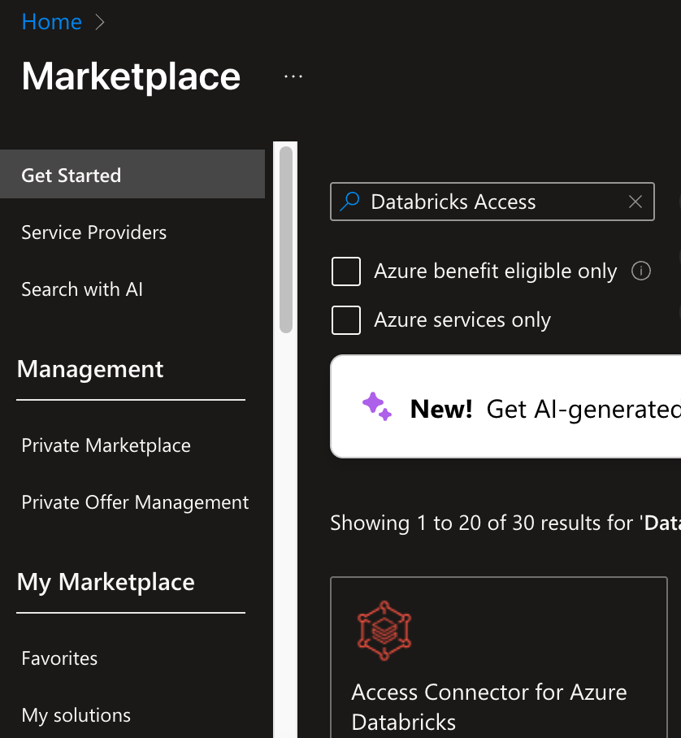
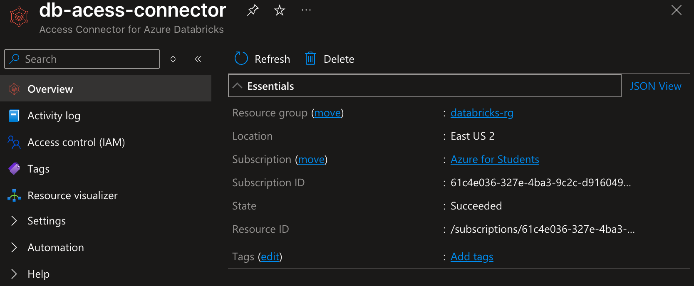

2. Atribuir a ele o papel Storage Blob Data Contributor no ADLS Gen2.

3. Esse ID será usado depois para criar o Metastore no Unity Catalog.

---

Para o databricks com UC, primeiramente eu preciso de Databricks Premium Workspace onde também e necessário configurar um metastore. Portanto, ao configurar o metastore, ele nos perguntará o local onde pode armazenar
as tabelas gerenciadas. Ao criar um metastore você precisa 
anexá-lo a um workspace.

* Para ter acesso ao console account é necessário ser um account admin. O que significa que a criação do workspace não é suficiente para dar a você o papel de Account Admin.

* Em resumo: O Administrador Global do Microsoft Entra ID torna-se o primeiro Account Admin do Databricks, mas essa associação não é automática para todos os Global Admins. Após a criação, o Global Admin pode (e deve) delegar a função de Account Admin do Databricks para o usuário final apropriado e, se quiser, remover a função de si mesmo.

Vamos lá

1. Crie um metastore(Esse metastore precisa está na mesma região que todas suas contas de armazenamento - ideal, workspace):
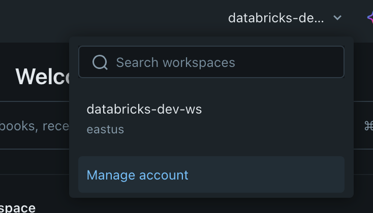

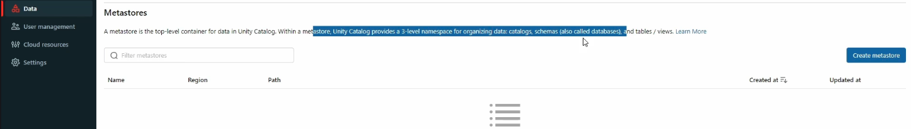

* Você pode criar um metastore por região, não é possível criar vários metastores para uma única região.

* O parâmetro ADLS Gen2 path é opcional se não estiver forcendo o caminho neste momento, enquanto estiver criando
objetos como esquema, catálogos ou tabelas, você precisará fornecer o caminho ali. (Esse caminho serve para armazenar tabelas gerenciadas desse metastore específico)

2. Anexe ao Workspace

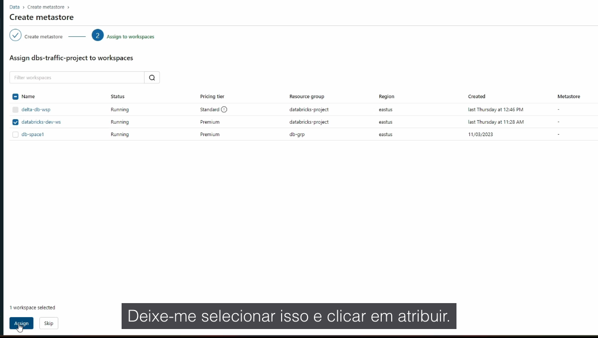

# O Escopo da Conta Databricks (vs. Azure Subscription)

Antes do UC: O controle de acesso (ACLs, Contributor/Reader) era feito no nível da Assinatura Azure. Se você não estivesse na assinatura, não tinha acesso ao Workspace.

Com o UC: O Databricks Account Console e o Metastore operam no nível do Tenant (Locatário) do Microsoft Entra ID.

Um único Tenant do Azure pode ter várias Assinaturas e, consequentemente, vários Workspaces espalhados por essas assinaturas.

O Account Console do Databricks tem visibilidade de todos os Workspaces dentro desse Tenant (independentemente da Assinatura ou Grupo de Recursos em que foram criados).

Isso permite que você anexe Workspaces de diferentes Assinaturas a um único Metastore, centralizando o controle de acesso e os metadados para toda a organização (Tenant).

Em suma, o Unity Catalog oferece uma camada de governança universal que se estende por todos os seus Workspaces, elevando o gerenciamento do nível do Workspace/Assinatura para o nível da Conta Databricks (que corresponde ao Tenant do Azure).

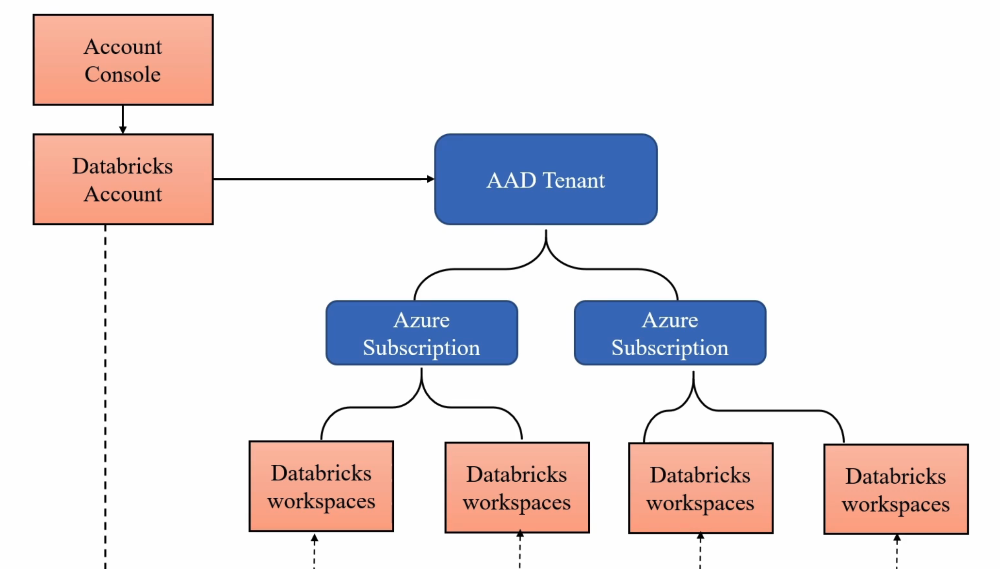

## Roles no Unity Catalog

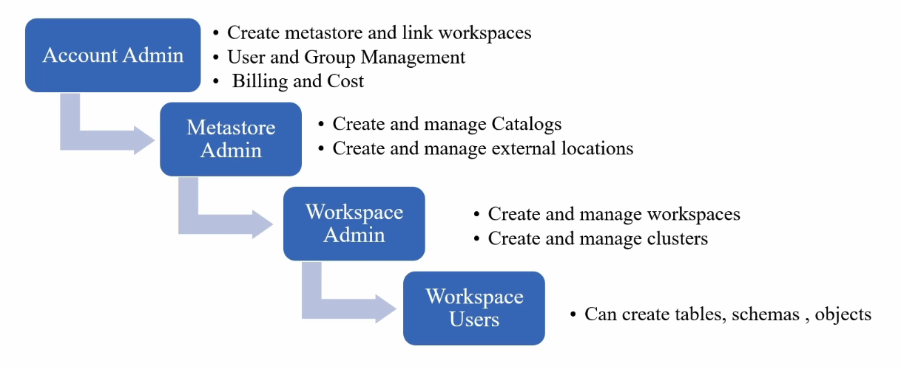

## Atribuindo permissões via Microsft Entra ID

1. Crie um usuário de exemplo para testar as permissões no UC.

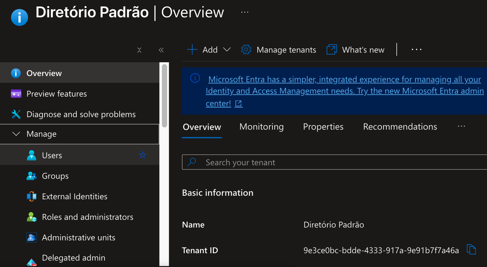

Usuário 1 - Jarvis (Workspace Admin) - Password: Mo@34633493  
Usuário 2 - Steve (Developers) -  Password: Mo@34633493

2. Criado os usuários no Microsoft Entra ID é necessário adicioná-los no UC

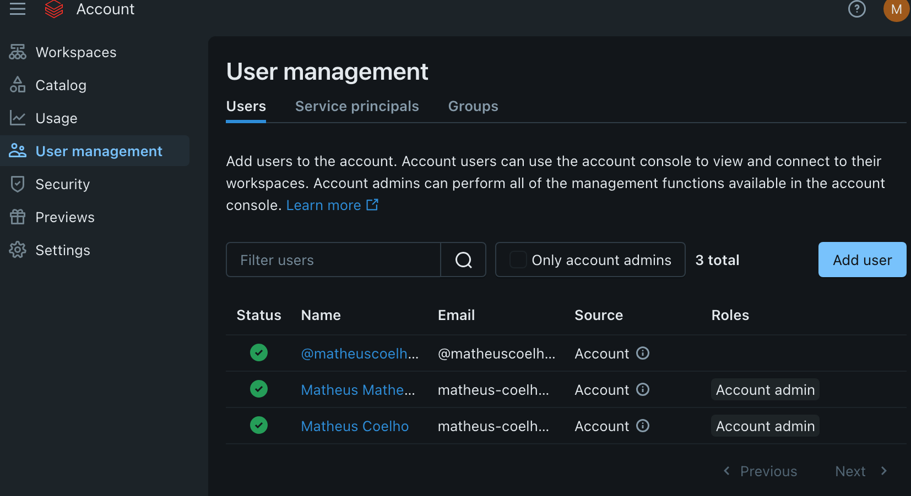

* Obs: Na prática real você fará isso por meio do provisionamento de usuários, em que você
adiciona o seu provedor de identidade e vai sincrizar com todos os seus usuários da organização.

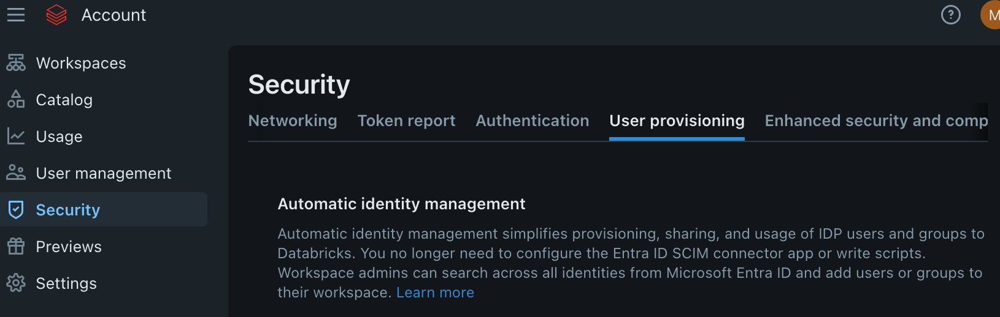

## User and Group Management

1. Adicionar os usuários no UC

2. Criar grupos no UC
- Workspace Admins
- Developers

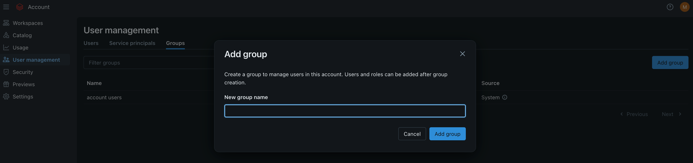

3. Dar as roles necessárias para cada grupo
 - Wokspace Admin - Workspace Admins Group
 - Wokspace User - Developers Group

 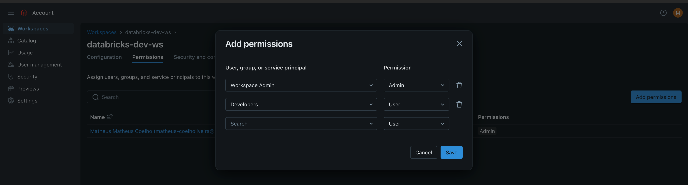

 * Permissão no nível admin, permite gerenciar grupos de usuários e a configuração do workspace. A permissão no nível user dá a permissão do usuário apenas acessar o workspace, criar coisas como schema, tabelas e pode ser proprietário dessas tabelas.

 Como estamos utilizando a databricks e ele não e necessário um serviço da Azure, o usuário não precisa ter acesso a nenhuma assinatura, apenas o link do workspace.

 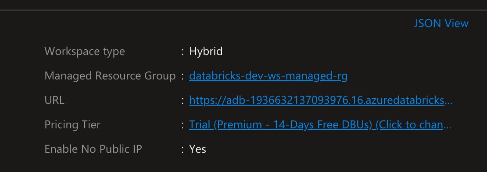

Se eu quiser desativar a criação de personal compute, para todos os usuários, faça isso:

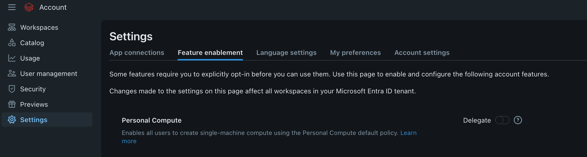

Agora o usuário Steve não consegue criar um personal compute.

## Cluster Policy

Cluster policy é util para controlar a capacidade dos usuários de configurar o cluster com base em determinadas regras. Portanto, essas regras especificam quais atributos ou valores de atributos podem ser usados durante a criação do cluster. E, com base nas políticas de cluster, ele têm algo como regras de controle de acesso que podem limitar os usuários e grupos específicos.

* Obs: Com a permissão de Workspace Admin eu posso liberar para um usuário específico conseguir criar um cluster.

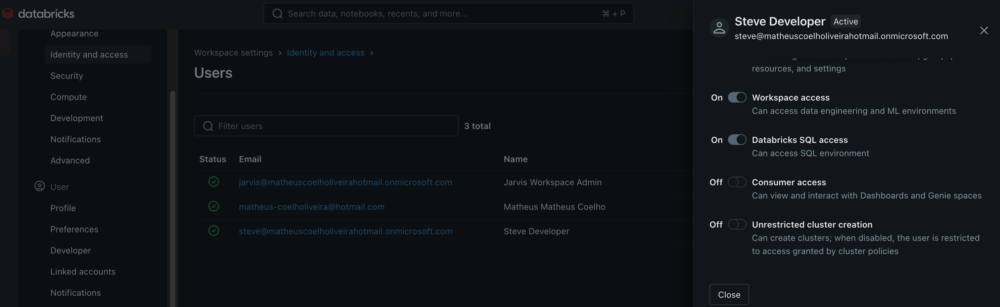

1. No console compute -> policies -> create policy -> Atribua um nome a policy -> Em familiy posso pegar modelos para me basear e criar a minha própria policy.

* Obs: O workspace admin vai poder criar cluster com base em várias policy, então quando quiser criar a policy para determinado usuário, crie um grupo sem ter a permissão de Admin e depois cria a policy para criação de cluster.

* Análise o terraform para verificar como criar policy por meio de IaC

* Você não pode usar instâncias spot para o nó do driver em um cluster do Azure Databricks, o que se aplica diretamente a clusters de nó único (que consistem apenas no nó do driver). 

# Cluster Pools

Podem ser utilizados para limitar a criação de usuários a um determinado tipo de instância ou para determinado grupo,
porém permite um tempo de inicialização mais rápido por conta que defino o mínimo instâncias igual a 1.

Então eu posso criar um pool com max instances = 2 e coloco min_idle = 1, porém nas permissões eu posso atribuir, por exemplo,
que meu grupo de developers acesse esse pool ai quando ele da um create cluster na seleção de cluster ele seleciona o nome do meu pool de forma que vai criar mais uma instância chegando ao máximo que é 2, porém o tempo de inicialização e bem rápido.

No cluster policy eu posso criar uma definição por exemplo para meus usuários criarem máquinas apenas do meu pool.

1. Copio o pool id

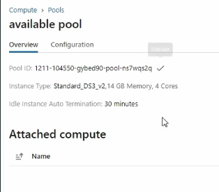

2. Atribuo no value do Json

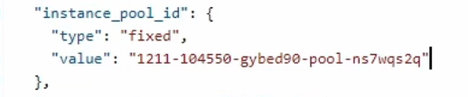

## Padrões de workspace para o databricks

Em geral, você pode considerar a criação de um catálogo para cada ambiente, no qual cada 
ambiente pode ser criado em um único catálogo. Ou seja, pode haver um catálogo de desenvolvimento, um catálogo de UAT e um catálogo de produção.

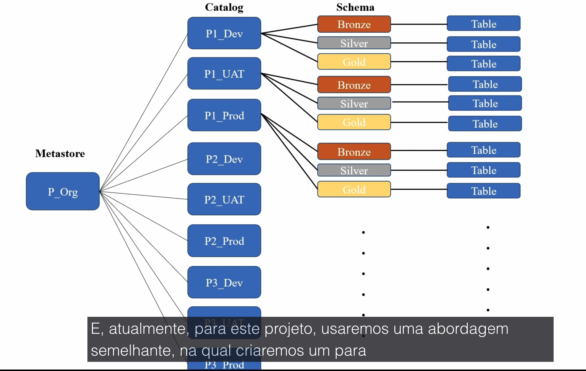

* Onde P1, P2 ... significam projetos/workspaces

* OBS: Workspace Admin não possuem acessos para criar catálogos por default, então é necessário atribuir essa permissão. Só um ponto de atenção no terraform talvez na primeira execução de erro na aplicação de policy no grupo developer, onde vai ser necessário anexar o grupo ao workspace antes de executar novamente, pode dar algum erro novamente, mas aguarde uns minutos de o terraform plan que vai ser sucesso.

Para um usuário trabalhar com o catálogo e necessário dar a permissão `USE CATALOG` ela permite que os usuários visualizem o catalógo apesar de não realizar nenhuma ação.

Query para ver informções do metastore como exemplo, onde fica as tabelas armazenadas por padrão (managed).

`SELECT
  *
FROM
  system.information_schema.metastores`

## Instalação de libs externas 

Para instalação de bibliotecas de modo nativo no cluster você pode utilizar cluster policy que nem foi realizado no terraform. Porém a databricks por segurança restringe a esse tipo de instalação e para isso foi criado a folder securiy do terraform que libera o acesso para instação da lib `maven`. 

Porém para aplicar isso no terraform é necessário que o User tenha a permissão `MANAGE ALLOWLIST`. 

Para fazer isso vá até catalógo e clique no simbolo da ingrenagem e logo após clique no nome do metastore.

Na aba permissões adicione a permissão `MANAGE ALLOWLIST`:

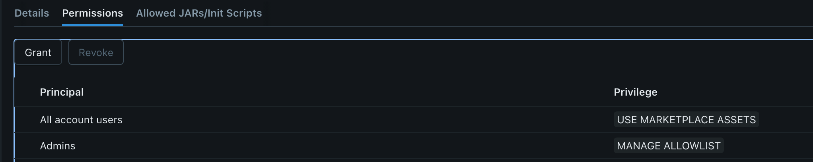

* Obs: A lib spark-measure só funciona no modo cluster single-user do databricks.

## Storage Credential & External Location

O Unity Catalog acessa o armazenamento principal (onde ficam as **tabelas gerenciadas**) por meio do **Databricks Access Connector**, usando uma **identidade gerenciada** configurada na criação do **Metastore**. Esse acesso vale apenas para o **contêiner raiz** definido nesse momento.

Em cenários reais, é comum precisar acessar **outras contas de armazenamento** ou **outros contêineres** (inclusive na mesma conta). Esses locais **não são reconhecidos automaticamente** pelo Unity Catalog e, sem configuração adicional, geram erros de acesso.

Para resolver isso, o Unity Catalog introduz dois novos objetos:

### 🔹 Credencial de Armazenamento (Storage Credential)
- Responsável pela **autenticação** no armazenamento.
- Armazena a identidade usada para acesso (preferencialmente **identidade gerenciada** via Databricks Access Connector, ou alternativamente um **Service Principal**).
- Define **“quem pode acessar”** o storage.

### 🔹 Local Externo (External Location)
- Funciona como um **ponteiro** para um caminho específico no armazenamento (ex: um contêiner).
- Usa uma **credencial de armazenamento** para obter acesso.
- Define **“onde estão os dados”**.

### 🔹 Diferença Conceitual
- **Local Externo** → guarda o **caminho** do armazenamento.
- **Credencial de Armazenamento** → guarda a **autenticação/acesso**.
- Ambos são necessários: **saber o caminho não é suficiente sem permissão**.

### 🔹 Benefício Principal
Esses dois objetos permitem que o Unity Catalog forneça **controle de acesso centralizado e refinado**, possibilitando acessar múltiplos storages ou contêineres de forma segura e sem credenciais embutidas em notebooks.

> A Databricks recomenda fortemente o uso de **identidades gerenciadas**, evitando segredos e autenticação manual.

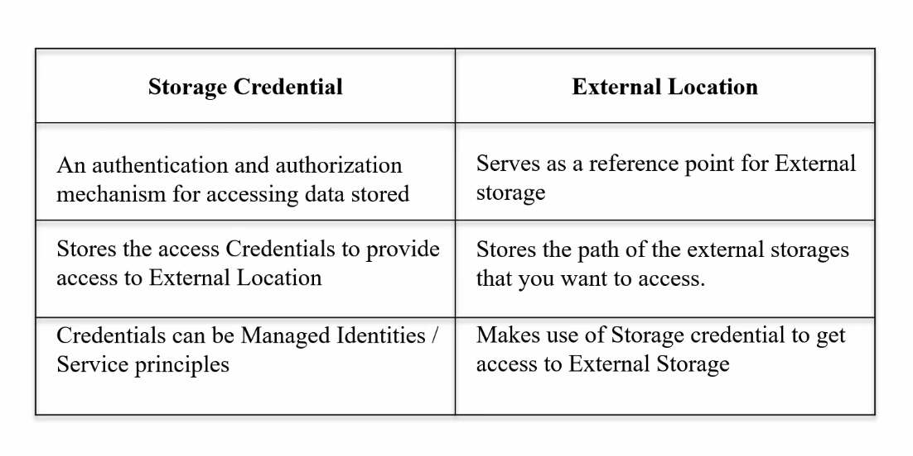

1. Primeira etapa é criar uma credential

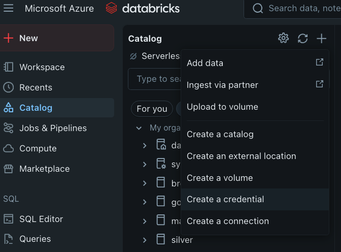

2. Selecione service credential

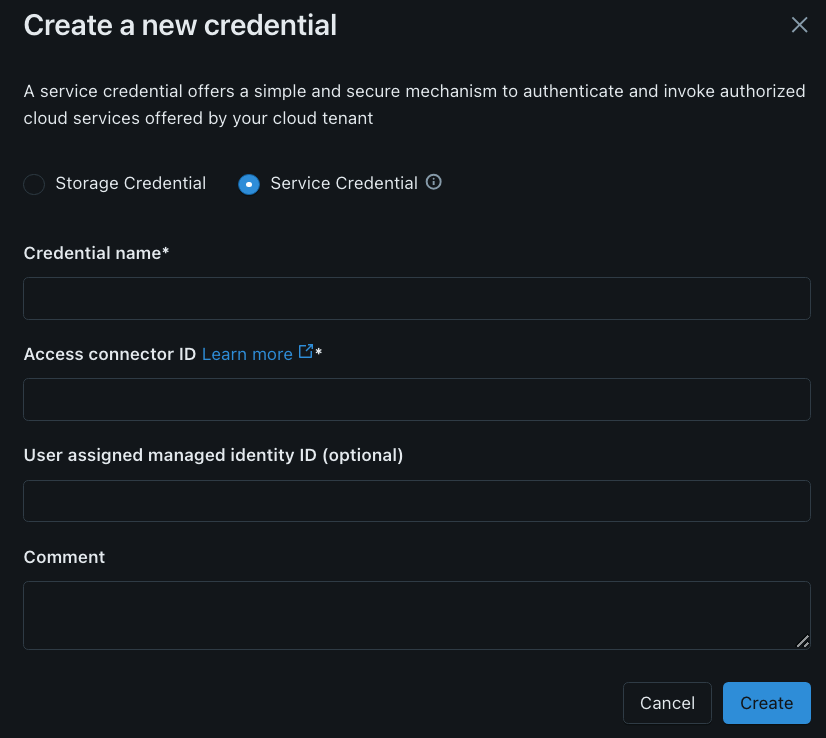

3. De um nome (Credential Name - Modulo no terraform chamado storage_credential) e o Acess Connector ID é o valor do Resource ID do Databricks Acess Conector. Lembrando que é nessário dar a role de contributor para storage account que você deseja acessar.

4. Para criar uma external location apenas clique em catálogo e External Locations. Irá aparece metastore_root_location que e o local das suas tabelas gerenciadas definida no metastore e você pode criar uma nova external location se necessário utilizando a credential criada anteriormente.

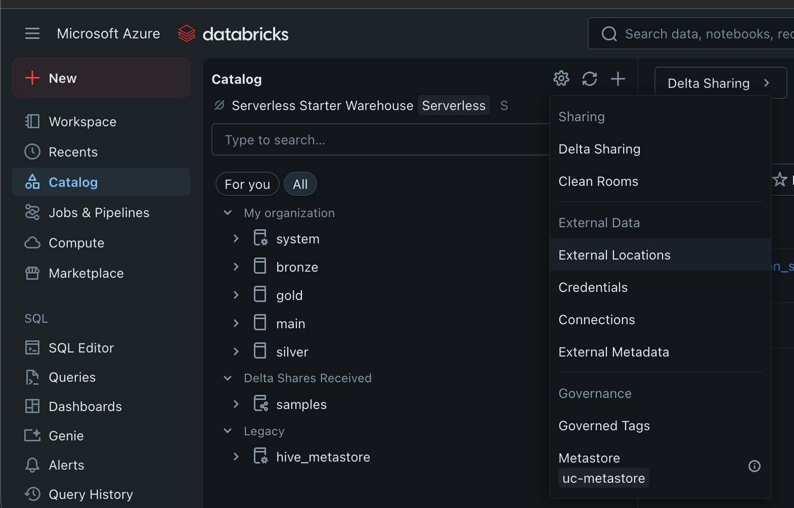

* Obs: A crição via terraform do external location pode ser visualizado no modulo external_location.
